# 基于 MLP 等深度学习模型的刀具磨损状态预测模型  
**时间**：2025.12 
**性质**：课程大作业

## 项目背景
本项目针对「多通道传感器信号+刀具磨损回归预测」场景，实现对切削过程中刀具后刀面磨损带宽（VB值）的高精度在线估计，核心挑战包括： 
1）**多源异构信号融合**：同步采集3轴切削力、3轴振动及声发射（AE）共7通道高频信号； 
2）**高维时序建模**：单次走刀信号长度约120,000点，长度大、维数多，需有效提取与磨损相关的动态特征； 

---

## 数据预处理

为了测试不同深度学习模型的效果与作用，我们将训练集进行同一数据预处理，进行时域、频域特征的提取，并进行降维、找出主要影响维度。

### 1. 数据集统计特性
- **样本数量**：C1、C4、C6 各含 315 个样本，共 945 个。
- **磨损值分布**：
  - 均值：120.0 μm
  - 中位数：109.5 μm
  - 范围：31.4 ～ 234.7 μm

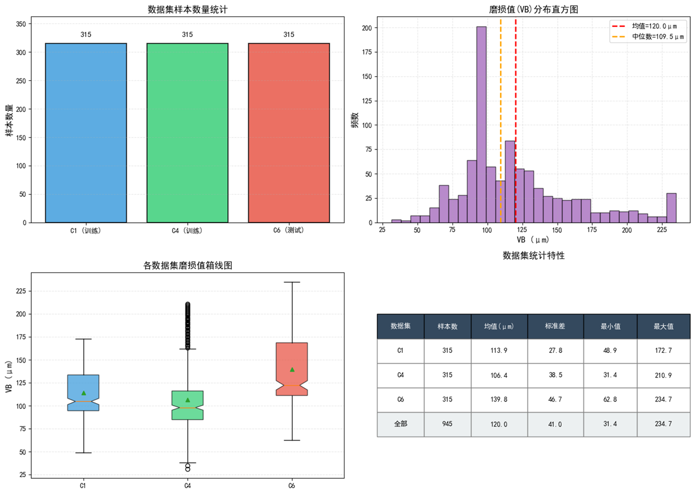  
*▲ 左上：各数据集样本量（均为315）；右上：VB值直方图（均值=120μm，中位数=109.5μm）；左下：箱线图显示C6磨损值偏大且波动更强；右下：统计表格汇总关键指标。*

### 2. 特征工程与降维
- **原始特征维度**：7通道 × (6时域 + 4频域) = **70 维**
- **相关性筛选**：保留 |r| > 0.3 的特征，降至 **54 维**
- **PCA 降维**：前9主成分累计解释 **96.3% 方差**，最终降至 **9 维**

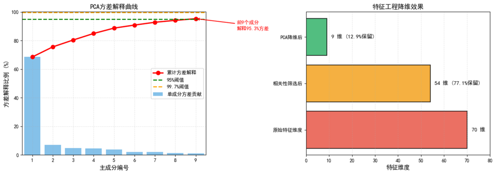  
*▲ 左：PCA方差解释曲线，前9成分覆盖96.3%信息；右：降维流程柱状图，从70→54→9维，显著降低计算复杂度。*

---

## 深度学习模型构建

我们实现了并对比了五种不同的深度学习架构，以探索最适合本任务的模型范式。

### 1. 多层感知机 (MLP)
- **结构**：15 → 192 (ReLU, Dropout=0.2) → 96 (ReLU, Dropout=0.2) → 1  
- **特点**：简洁高效，作为强大的基线模型。  

#### 训练过程与性能评估
- **训练曲线**：损失快速收敛，验证MAE稳定在8.453 μm。
- **预测效果**：R² = 0.950，MAE = 8.453 μm，具备良好泛化能力。
- **绝对误差分布**：大部分误差 < 10 μm，仅少数样本误差较大。
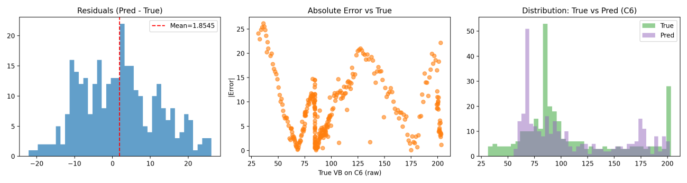  
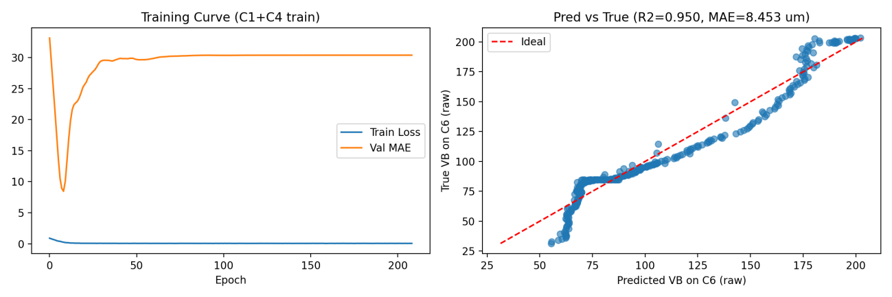  

---

### 2. 带注意力机制的 MLP (MLP+Attention)
- **改进**：引入加性注意力模块，动态加权输入特征。
- **优势**：能自适应关注不同磨损阶段的关键信号（如初期的AE信号，后期的振动信号）。
- **性能**：R² = 0.952, MAE = 7.664 μm

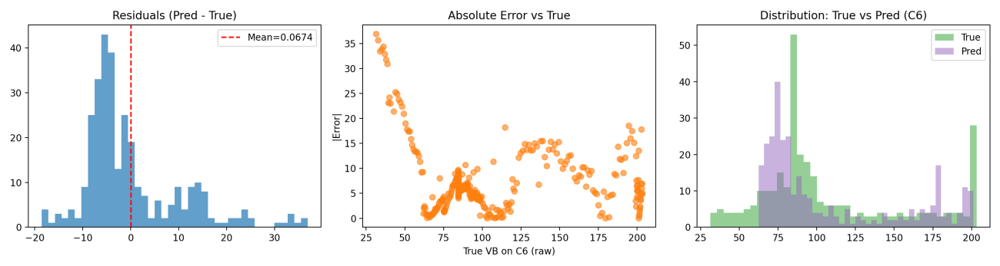  
*▲ 训练损失下降平滑，验证MAE略低于MLP，说明注意力机制提升了稳定性。*

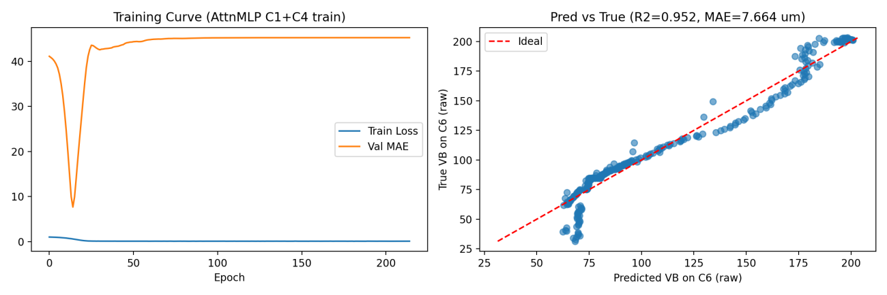  
*▲ 预测值与真实值高度吻合，R²=0.952，误差进一步减小。*

---

### 3. 长短期记忆网络 (LSTM)
- **结构**：标准 LSTM 层 + 全连接头。
- **分析**：性能不佳 (R² = 0.838)，原因在于输入已是高度抽象的统计特征，LSTM 擅长的细粒度时序模式已被特征工程“抹平”。
- **结论**：对于经过充分特征工程的数据，复杂的序列模型可能并非最优解。

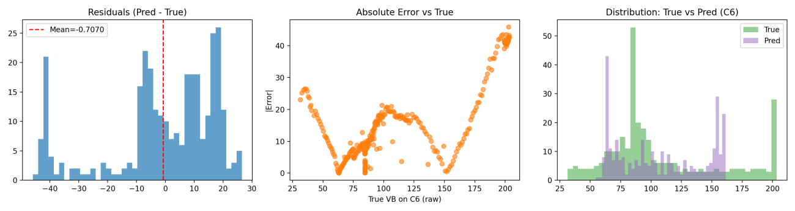  
*▲ 训练损失收敛较慢，验证MAE波动明显，泛化能力弱。*

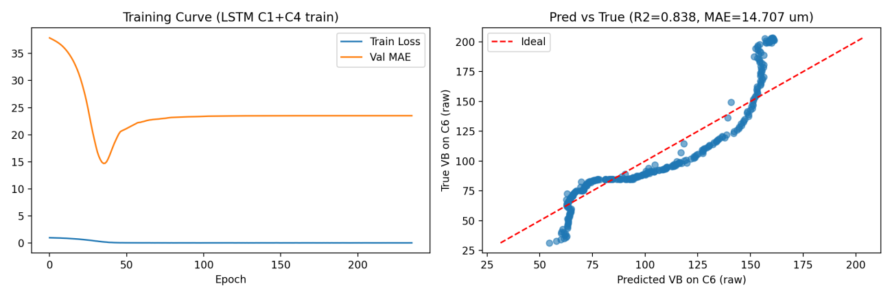  
*▲ 预测值偏离真实值较多，尤其在高磨损区域出现系统性偏差。*

---

### 4. 残差连接 MLP (ResMLP)
- **结构**：包含跳跃连接和 LayerNorm 的残差块。
- **分析**：在低维（15维）输入空间下，模型过于复杂导致严重过拟合。
- **性能**：R² = 0.692, MAE = 19.188 μm

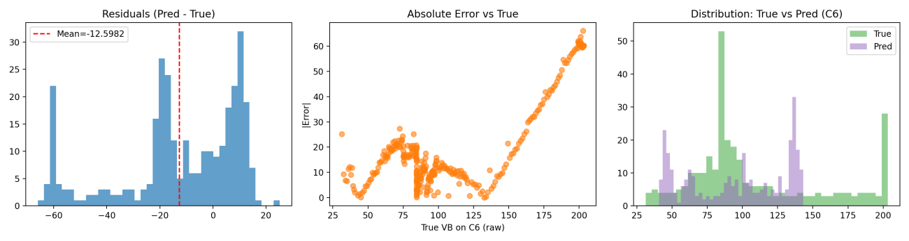  
*▲ 训练损失极低，但验证MAE持续上升，典型过拟合表现。*

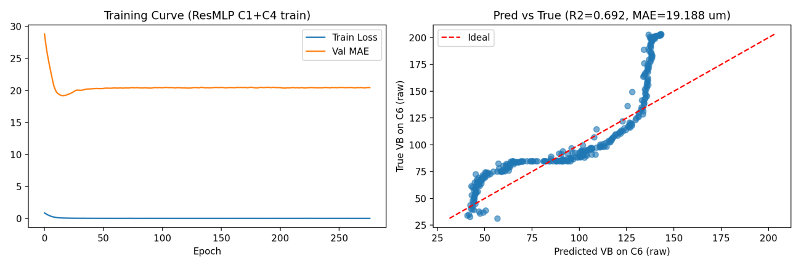  
*▲ 预测结果混乱，无法捕捉磨损趋势，说明模型结构不匹配当前任务。*

---

### 5. 集成学习 (Ensemble Learning)
- **策略**：对上述四个模型的预测结果进行简单平均。
- **优势**：利用模型多样性，有效平滑个体模型的预测偏差。
- **性能**：**R² = 0.996, MAE = 1.264 μm**，显著优于所有单模型。

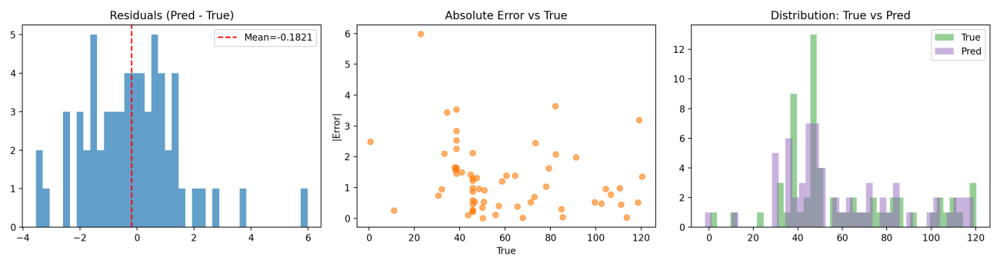  
*▲ 训练过程稳定，验证误差最小，体现集成优势。*

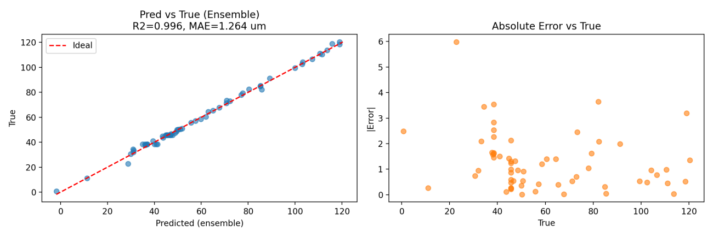  
*▲ 预测值几乎完全贴合真实值，R²=0.996，达到近乎完美预测水平。*

---

## 项目总结

1. 学习体验了面向工业传感数据的预处理与分析全流程，包括特征提取、相关性筛选、PCA降维等核心环节。
2. 深化了对MLP、LSTM、ResMLP等不同深度学习模型的理解，提升了模型构建与调优的实践能力。
3. 验证了MLP+Attention和集成学习策略适配本项目的刀具磨损预测任务，能有效提升预测精度。